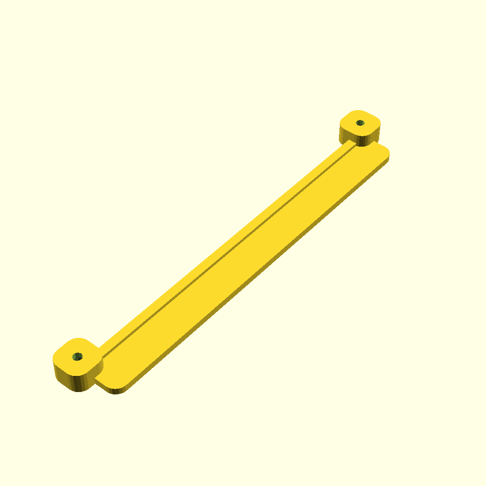

# Fujitsu Futro s940 wallmount
A simple wallmount written with open-scad for the Fujitsu Futro S940.
Two holders (green in the overview) gets screwed with M2.5mm screws to the bottom of the S940.
It can then slide into the wall mounted rails (blue).
An optional distance plate (brown) can be used for better cooling and/or cables between the wall and D940.

Find the .stl files in the STL folder.

I printed with PLA+, 30% infill, 0.4mm nozzle, layerheight 0.2mm.

